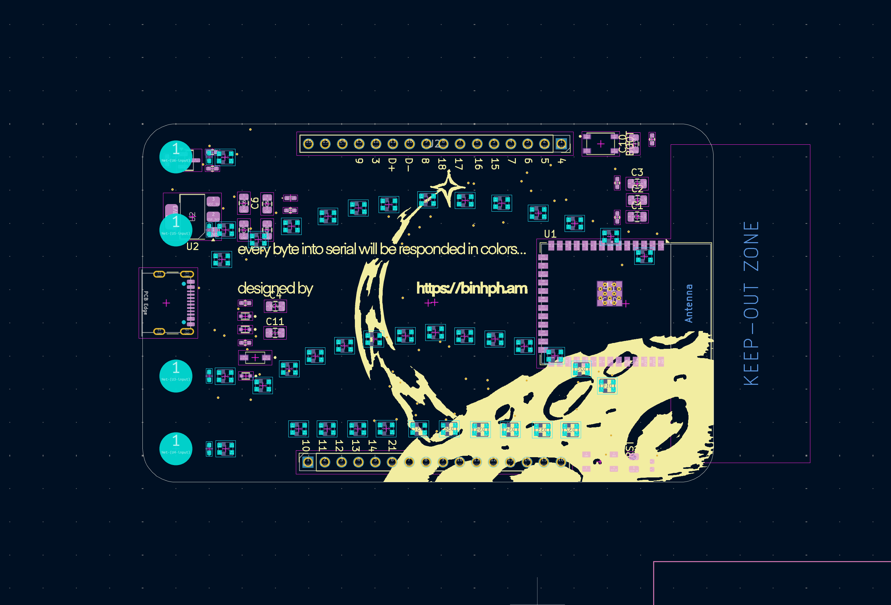

# Bouija


A PCB business card that runs an LLM locally with an Ouija board-inspired LED layout.

Watch a video on the design of this business card [here](https://youtu.be/WC3O2cKT8Eo).

**Special thanks to NextPB for sponsoring this project. Check out their website [here](https://www.nextpcb.com?code=Build_With_Binh)**

## Overview

Bouija is a unique business card featuring an ESP32-S3 that runs a local Large Language Model. The device uses 40 individually addressable WS2812B LEDs arranged in an Ouija board pattern to visualize text generation in real-time.

## Specifications



- **PCB Dimensions**: 85mm × 54mm with 3mm corner radius
- **LEDs**: 40 WS2812B LEDs
  - 26 letters (A-Z)
  - 10 numbers (0-9)
  - 4 shortcuts: cap, slap, peace, sup
- **MCU**: ESP32-S3 with 8MB PSRAM and 16MB Flash
- **Layout**: Ouija board arrangement for cultural authenticity

## Firmware Options

### Simple Mode (`/firmware/simple`)

Hard-coded messages with LED visualization and touch interaction.

### LLM Mode (`/firmware/tinyllama`)

Local LLM text generation using [Dave Bennett's ESP32 LLM implementation](https://github.com/DaveBben/esp32-llm). Credit to Dave Bennett for the LLM core - I added the visualization and interaction layer.

## Setup

Requires ESP-IDF toolchain:

```bash
# Navigate to desired firmware directory
cd firmware/tinyllama  # or firmware/simple

# Build and flash
idf.py build
idf.py -p /dev/{DEVICE_PORT} flash
```

## Hardware

The PCB design is available in `/pcb` as a KiCad project.

## Why "Bouija"?

It's a play on "Ouija" + "Binh" (the creator's name) - because what's a business card without a little wordplay? 👻

---

_Running AI on a business card because why not?_
